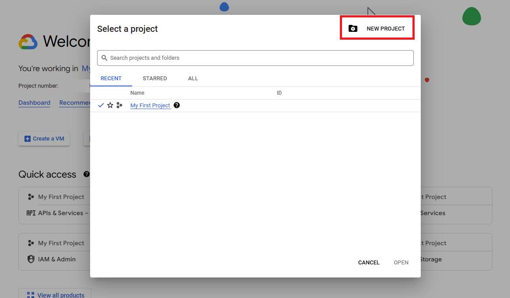
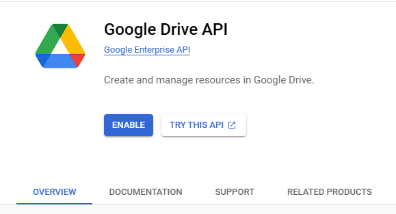
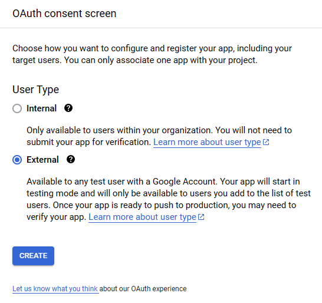
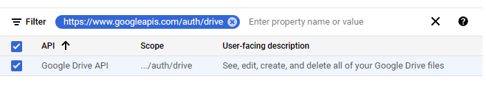
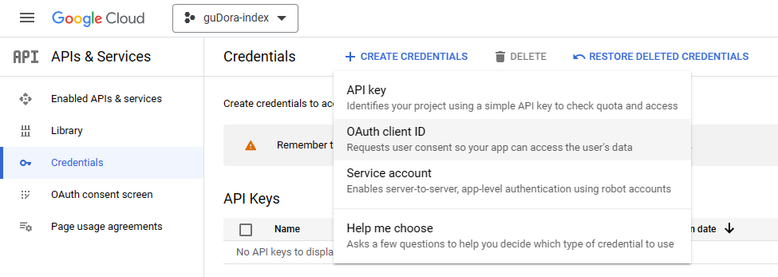
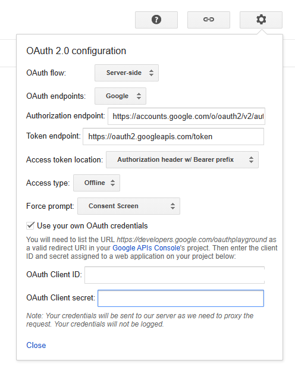
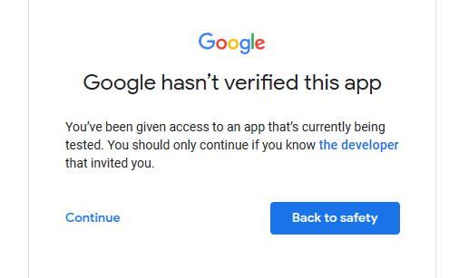
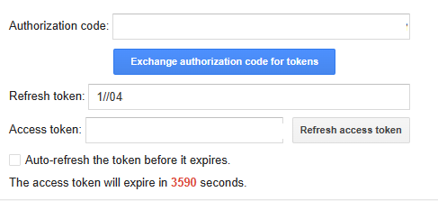

# Google Cloud Setup

Table of Contents:
- [Making a Google Cloud Project and enabling Google Drive API](#making-a-google-cloud-project-and-enabling-google-drive-api)
- [Creating Oauth Consent Screen](#creating-oauth-consent-screen)
- [Creating Oauth Client ID](#creating-oauth-client-id)
- [Getting Refresh Token](#getting-refresh-token)

## Making a Google Cloud Project and enabling Google Drive API
1. Open [Google Cloud Console](https://console.cloud.google.com/).
2. Click on the project selector dropdown in the top left corner and select or create a new project.  

3. Activate the [Google Drive API](https://console.cloud.google.com/apis/library/drive.googleapis.com) for your project.  

4. After activating the API, you will be redirected to the API overview page. For creating Oauth Client ID, you need to create Oauth consent first, you can do this by clicking on the "Oauth Consent Screen" menu.

## Creating Oauth Consent Screen
1. On the Oauth consent screen page, select "External" as the user type and click on the "Create" button.  

2. On the next page, fill in the required information and click on the "Save" button.
(In my case I'm only filling `App name`, `User support email`, and `Developer contact information`.)
3. On the **Scopes** Page, select the following scopes and click on the "Save" button, then click on the "Continue" button.    

4. On the **Test Users** Page, click on the "Add Users" button and add your email address or any other email address that you want to use. Then click on the "Save and Continue" button.
5. And you're done with the Oauth consent screen. Now you can create the Oauth Client ID by clicking on the "Credentials" menu.  
**NOTE: We don't need to publish the app, since we're only using it for our own purpose.**

## Creating Oauth Client ID
1. On the **Credentials** page, click on the "Create Credentials" button and select "Oauth Client ID".  

2. On the next page, select "Web Application" as the application type, and fill in the required information.
3. In the **Authorized redirect URIs** section, add the following redirect URI: `https://developers.google.com/oauthplayground`, then click on the "Create" button.
4. After creating the Oauth Client ID, you will be redirected to the **Credentials** page. Then copy the Client ID, and Client Secret. (You will need them later on the bottom of this page, and to fetch refresh token.)

## Getting Refresh Token
1. Open [Google OAuth Playground](https://developers.google.com/oauthplayground/).
2. Click on the gear icon on the upper right corner and check the box next to "Use your own OAuth credentials" and paste the Client ID and Client Secret that you copied earlier.  

3. Select the following scopes and click on the "Authorize APIs" button.  

4. Google will ask you to log in to your Google account, you need to log in using the account that specified on Test User (Creating Oauth Consent Screen - step 4).
5. It will show you a warning that the app is not verified, simply click on "Continue" button, and it will redirect you back to the Playground.   

6. Click on the "Exchange authorization code for tokens" button, and it will show you the refresh token. Copy the refresh token and paste it on the bottom of this page.  

7. You can close the Playground tab now.
8. You're done with the Google Cloud Setup.